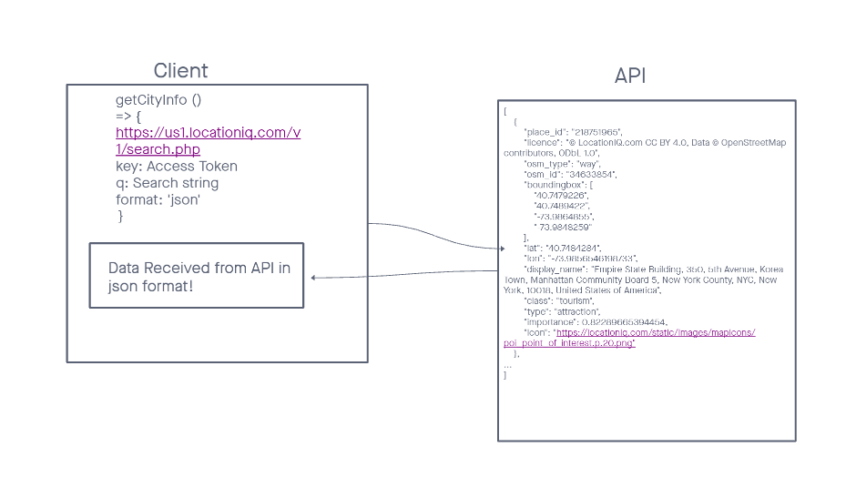
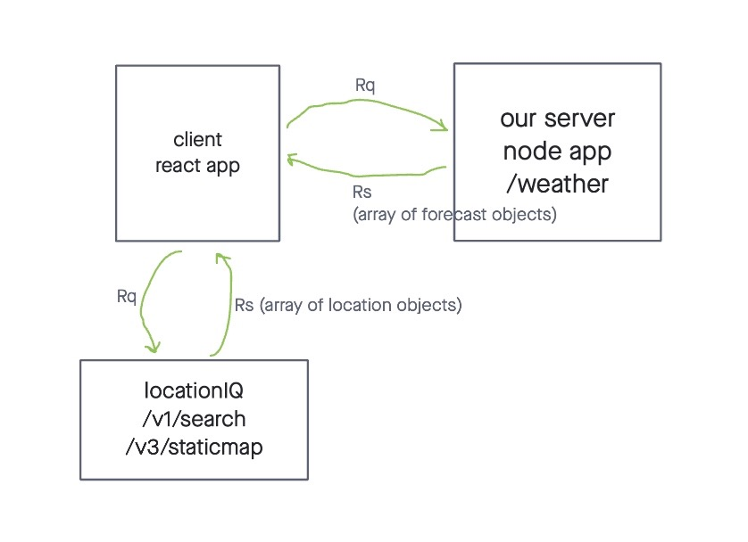
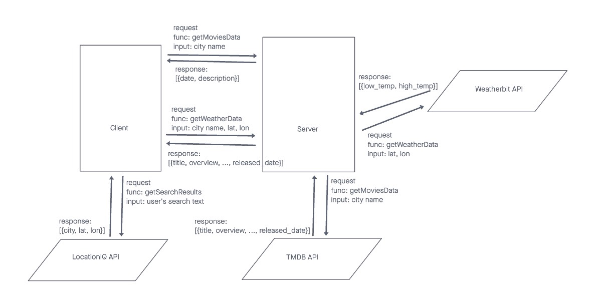

# Project Name

**Author**: Your Name Goes Here
**Version**: 1.1.0 (increment the patch/fix version number if you make more commits past your first submission)

## Overview

This is a class assignment for Code Fellows 301. This is a city guide app that enables a user to search for a city to map its location, to list what movies are related to that city, and to show the weather forecast.

## Getting Started

The client side of this app runs in most modern browsers, and an internet connection will be needed for the API calls. The server side of this app needs to be installed onto server capable of running nodejs. Relevant API keys will need to be supplied to the server and client side hosts.

## Architecture

Written in JavaScript using the React (for UI) and Axios (for API calls) libraries. LocationIQ is the API used for getting location data. Additional API calls are made to a custom nodejs/express server, which in turn makes API calls to get movie and weather data.

## Change Log

1/1/21: First release that implements the location functionality.
1/2/21: Added placeholder weather data.
1/3/21: Added live weather and movie data.

## Credit and Collaborations

Code Fellows 301 course material for user stories and requirements for the app.

## Time Estimates

Lab 06 Feature 1: Set up react repo and API keys

- Estimate of time needed to complete: 15 minutes
- Start time: 3:34 pm
- Finish time: 5:37 pm
- Actual time needed to complete: 2 hours 3 minutes

Lab 06 Feature 2: Locations

- Estimate of time needed to complete: 15 minutes
- Start time: 5:37 pm
- Finish time: 8:34 pm
- Actual time needed to complete: 2 hours 57 minutes

Lab 06 Feature 3: Map

- Estimate of time needed to complete: 1 hour
- Start time: 8:34 pm
- Finish time: 11:30 pm
- Actual time needed to complete: 2 hours 56 minutes

Lab 06 Feature 4: Errors

- Estimate of time needed to complete: 15 minutes
- Start time: 11:30 pm
- Finish time: 12:05 am
- Actual time needed to complete: 35 minutes

Lab 07 Feature 4: Set up server repo

- Estimate of time needed to complete: 15 minutes
- Start time: 6:20 pm
- Finish time: 6:37 pm
- Actual time needed to complete: 17 minutes minutes

Lab 07 Feature 4: Weather (placeholder)

- Estimate of time needed to complete: 1 hour
- Start time: 6:38 pm
- Finish time: 10:32 pm
- Actual time needed to complete: 3 hours 36 minutes

Lab 07 Feature 4: Errors (revisited)

- Estimate of time needed to complete: 1 hour
- Start time: 10:32 pm
- Finish time: 11:48 pm
- Actual time needed to complete: 1 hour 16 minutes

Lab 08 Feature 1: Weather (live)

- Estimate of time needed to complete: 1 hour
- Start time: 5:17 pm
- Finish time: 6:49 pm
- Actual time needed to complete: 1 hour 32 minutes

Lab 08 Feature 2: Movies

- Estimate of time needed to complete: 1 hour
- Start time: 6:53 pm
- Finish time: 8:07 pm
- Actual time needed to complete: 1 hour 14 minutes

Lab 08 Feature 3: Publish

- Estimate of time needed to complete: 30 minutes
- Start time: 10:20 pm
- Finish time: 10:35 pm
- Actual time needed to complete:  15 minutes

Lab 06 WRRC:

Lab 07 WRRC:

Lab 08 WRRC:

